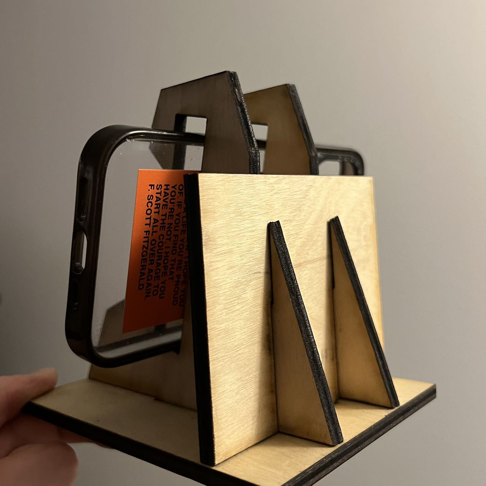
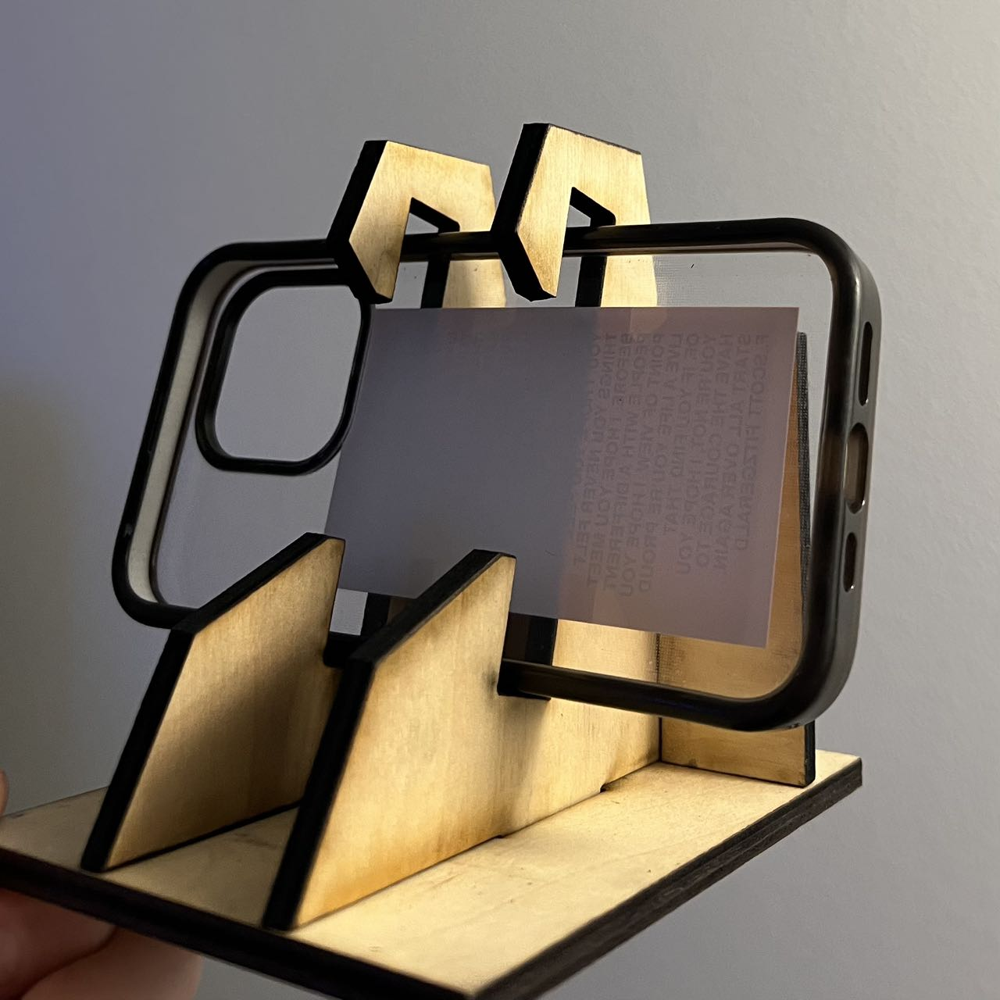
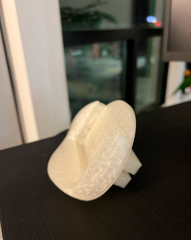

# Weekly Reports
Welcome to your new GitHub repository! 

---
Week of 08/28 Report
---
# Reflections
This week, our main task was centered on Rhino, Grasshopper, and incorporating laser cutting to create a phone stand. My journey with Rhino began a few years ago. The exercise gave me an opportunity to brush up on the foundational knowledge that I have not been using recently. Grasshopper is quite different from the direct modeling approach in Rhino. While I am well-acquainted with Rhino, Grasshopper's node-based system is challenging for me. The logic and the connection of components seemed a bit overwhelming and I plan to dig deeper into this in the following weeks. The laser-cutting process was straightforward. The more challenging part is to ensure that the laser is cutting through the wood boards. I'm looking forward to making more exiting projects later on. The following images are of the phone stand and the process of making it. 

# Speculations
I think Rhino will continue to integrate more intuitive tools, making it more user-friendly. As for Grasshopper, I wish there would also be a more visual/beginner-friendly interface so that it's easier to navigate. I think there will be more plugins, easier UI, and perhaps AI-driven components to predict and auto-generate designs based on user input.

---
Week of 09/04 Report
---
# Reflections
I got Covid this week and wasn't able to come to class. In my free time, I explored Rhino and Grasshopper by following along YouTube tutorials. Here are some useful tutorials I found online:    
https://www.youtube.com/watch?v=zDGO_FG8UOw&t=322s&ab_channel=TheDifferentDesign     
https://www.youtube.com/watch?v=QvBxQTir5TY&t=29s&ab_channel=ProvingGround    
https://www.youtube.com/watch?v=YderMrJ5Ol0&t=232s&ab_channel=PhilippGalvanDesign    
https://www.youtube.com/watch?v=o3W7V9llWfw&t=190s&ab_channel=Shimayama   

# Speculations
AI will not replace designers but will amplify their capabilities. It will be a co-designer, assisting in brainstorming, testing, and even challenging human designers to push boundaries. AI can generate thousands of design variations based on certain criteria, giving designers a broad spectrum of options to choose from. This means that instead of starting from scratch, designers can refine AI-generated proposals. For example, I provide the phone I use and the car I drive, then AI can auto generate a car phone holder for me! AI will also bring empathy into computational design, understanding the end-user on a deeply personal level, allowing for designs that cater to emotional as well as functional needs.

---
Week of 09/11 Report
---
# Reflections
This week I was mainly working on Project 1. The journey of this project has been both challenging and rewarding. I was able to learn something new every day and this was my first time using a 3D printer! Leveraging Rhino and Grasshopper, the project successfully demonstrated the profound impact computational design can have on product evolution. I pursued this project at the challenge level 02-Platypus. I chose this level because it’s slightly more challenging for me than the basic, and it can push my boundaries out of my comfort zone to explore new territories of design. Transitioning to Rhino, with prior experience in tools like AutoCAD and SolidWorks, was easier than I expected. The real challenge for me was learning Grasshopper. I’ve never used a visual programming software before, and I took some time to fully understand and interact with the sea of components. This challenge aligned well with my chosen Platypus level as it demanded not just the modification of the existing inputs, but also the integration of a new design, in my case, the clip on the back of the holder. 
   
   

# Speculations
The designed phone holder facilitates seamless interaction between humans and their environment - it allows me to view my screen while driving - and it’s just an surface level example of technology's role in enhancing day-to-day experiences. With computational design, spaces and products can be designed to adapt more naturally to human needs and preferences. This can lead to environments that change in real-time according to human presence, optimizing comfort, utility, and aesthetics. 
