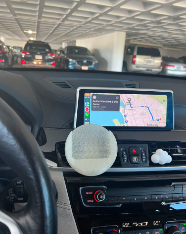

# Weekly Reports
Welcome to your new GitHub repository! 

---
Week of 08/28 Report
---
# Reflections
This week, our main task was centered on Rhino, Grasshopper, and incorporating laser cutting to create a phone stand. My journey with Rhino began a few years ago. The exercise gave me an opportunity to brush up on the foundational knowledge that I have not been using recently. Grasshopper is quite different from the direct modeling approach in Rhino. While I am well-acquainted with Rhino, Grasshopper's node-based system is challenging for me. The logic and the connection of components seemed a bit overwhelming and I plan to dig deeper into this in the following weeks. The laser-cutting process was straightforward. The more challenging part is to ensure that the laser is cutting through the wood boards. I'm looking forward to making more exiting projects later on. The following images are of the phone stand and the process of making it. 

# Speculations
I think Rhino will continue to integrate more intuitive tools, making it more user-friendly. As for Grasshopper, I wish there would also be a more visual/beginner-friendly interface so that it's easier to navigate. I think there will be more plugins, easier UI, and perhaps AI-driven components to predict and auto-generate designs based on user input.

---
Week of 09/04 Report
---
# Reflections
I got Covid this week and wasn't able to come to class. In my free time, I explored Rhino and Grasshopper by following along YouTube tutorials. Here are some useful tutorials I found online:    
https://www.youtube.com/watch?v=zDGO_FG8UOw&t=322s&ab_channel=TheDifferentDesign     
https://www.youtube.com/watch?v=QvBxQTir5TY&t=29s&ab_channel=ProvingGround    
https://www.youtube.com/watch?v=YderMrJ5Ol0&t=232s&ab_channel=PhilippGalvanDesign    
https://www.youtube.com/watch?v=o3W7V9llWfw&t=190s&ab_channel=Shimayama   

# Speculations
AI will not replace designers but will amplify their capabilities. It will be a co-designer, assisting in brainstorming, testing, and even challenging human designers to push boundaries. AI can generate thousands of design variations based on certain criteria, giving designers a broad spectrum of options to choose from. This means that instead of starting from scratch, designers can refine AI-generated proposals. For example, I provide the phone I use and the car I drive, then AI can auto generate a car phone holder for me! AI will also bring empathy into computational design, understanding the end-user on a deeply personal level, allowing for designs that cater to emotional as well as functional needs.

---
Week of 09/11 Report
---
# Reflections
This week I was mainly working on Project 1. The journey of this project has been both challenging and rewarding. I was able to learn something new every day and this was my first time using a 3D printer! Leveraging Rhino and Grasshopper, the project successfully demonstrated the profound impact computational design can have on product evolution. I pursued this project at the challenge level 02-Platypus. I chose this level because it’s slightly more challenging for me than the basic, and it can push my boundaries out of my comfort zone to explore new territories of design. Transitioning to Rhino, with prior experience in tools like AutoCAD and SolidWorks, was easier than I expected. The real challenge for me was learning Grasshopper. I’ve never used a visual programming software before, and I took some time to fully understand and interact with the sea of components. This challenge aligned well with my chosen Platypus level as it demanded not just the modification of the existing inputs, but also the integration of a new design, in my case, the clip on the back of the holder. 
   
   

# Speculations
The designed phone holder facilitates seamless interaction between humans and their environment - it allows me to view my screen while driving - and it’s just an surface level example of technology's role in enhancing day-to-day experiences. With computational design, spaces and products can be designed to adapt more naturally to human needs and preferences. This can lead to environments that change in real-time according to human presence, optimizing comfort, utility, and aesthetics. 

---
Week of 09/18 Report
---
# Reflections
This week, we were introduced to Particle Photon 2 and experimented with basic wirings, such as light an LED and using a photoresistor. 

# Speculations
As technology continues to evolve, one can speculate that tools like the Particle Photon will become integral in creating interconnected systems, enhancing everyday life. It's exhilarating to think that today's simple LED experiment could be the precursor to future smart homes, wearable technologies, or even urban infrastructure that responds dynamically to environmental changes.

---
Week of 09/25 Report
---
# Reflections
This week we were first introduced to our group project and started collaborating on the project. At first we came up with a lot of ideas, but given the limited time and the lack of technical experience across the group, we narrowed down our ideas to the printer + shredder combo. We were a diverse group with varied levels of technical expertise, but that only added richness to our discussions. The printer + shredder combo idea arose from our collective desire to address both convenience and sustainability.
# Speculations
Given the growing emphasis on data protection and the need for mental health awareness across campus, we speculate that our printer + shredder combo could be a game-changer for the graduate student mental health issue. The product encourages spreading positivity amoung the community, as well as raising awareness for the general public.

---
Week of 10/02 Report
---
# Reflections
This week, we changed our idea. We chose the LED display over the printer. We also decided to have students tear up the paper by hand. We did this because we didn't have enough time to make the shredder gear and there is very limited documentation online for connecting a thermal printer to Photon 2. I think this is an important decision for us because it saved a lot of time, or we could potential find ourselves in a dead-end. We also devided up the work, with two of us working on the LED display, and the rest working on photon communication.

# Speculations
This project made me wonder - how many of us are experiencing negative thoughts everyday as we walk in and out of the buildings? How do people deal with stress and anxiety? Do people prioritize mental health when they are facing tight deadlines and peer pressure? I think it would be really meaningful if something like what we are working on can be found in all of the building across the campus. 

---
Week of 10/09 Report
---
# Reflections
Based on our observations and findings, we decided to design an “emotional vending machine.” Users will jot down their negative feelings on provided post-it notes, put them into the box slot, and in return, receive cheerful and uplifting messages displayed on the OLED board to lift their spirits. This week we are finishing up Project 2. We were finally able to nail down the direction that we are heading towards - the digital LED screen instead of an actual physical printer. 
# Speculations
In future development, I would love to look more into connecting a physical printer with photon 2 as it creates a more holistic and tangible experience. 

---
Week of 10/16 Report
---
# Reflections and Speculations
This week we finally finished Project 2! I'm grateful for the experience with this project. Some reflections and speculations: 
Message Personalization: If the vending machine could be incorporated with AI capabilities in the future, it could generate personalized uplifting messages based on the content of the notes. This would provide a more targeted and meaningful interaction for the user.
Safety Concerns: On the downside, there may be concerns about users writing potentially harmful or distressing messages. There would need to be a way to address this, perhaps by incorporating an alert system or monitoring feature.
Authenticity and Repetition: While the uplifting messages can be heartening the first few times, there may be diminishing returns with repeated interaction. Ensuring the messages remain fresh, authentic, and relevant would be crucial.
Privacy Concerns: Since emotions are private and personal, some might feel uncomfortable sharing them in a public space, even if it's anonymous. Measures to ensure confidentiality and promote a safe environment around the machine would be important. For future development, we can figure out a mechanism that prevents the users from accessing the pieces of paper in the box.
Team Work: The overall group-work experience was very positive, and everyone contributed a lot to the project. Each member brings unique insights, and our collective expertise shaped the project's success.
Holistic Approach to Well-being: The vending machine can be part of a larger initiative to promote graduate students' mental well-being. Encouraging other methods like counseling, peer support groups, or stress-relieving activities would provide a comprehensive approach to mental health.

